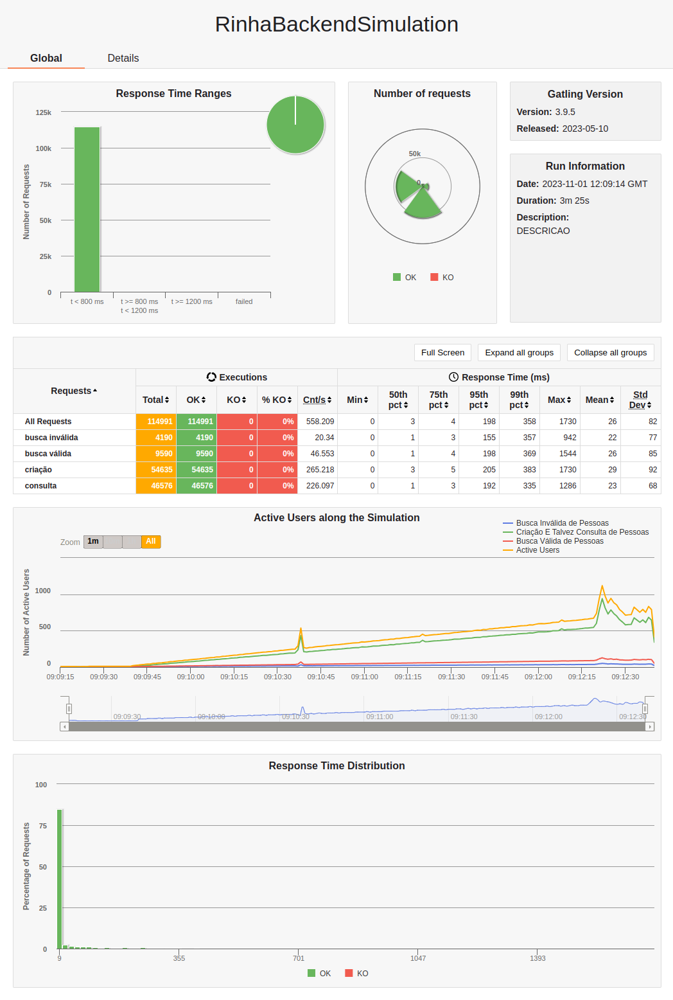
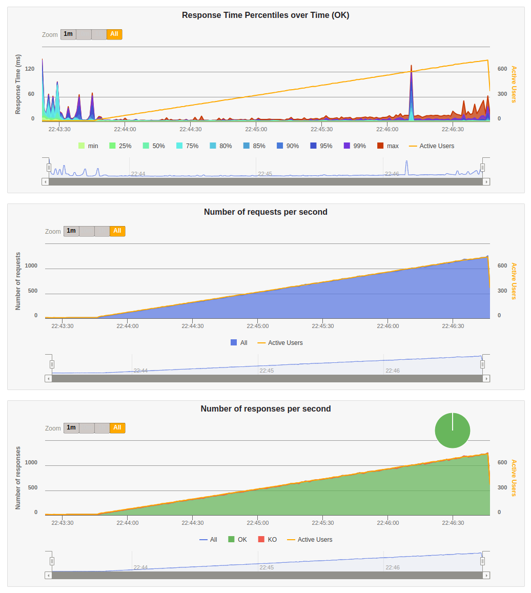
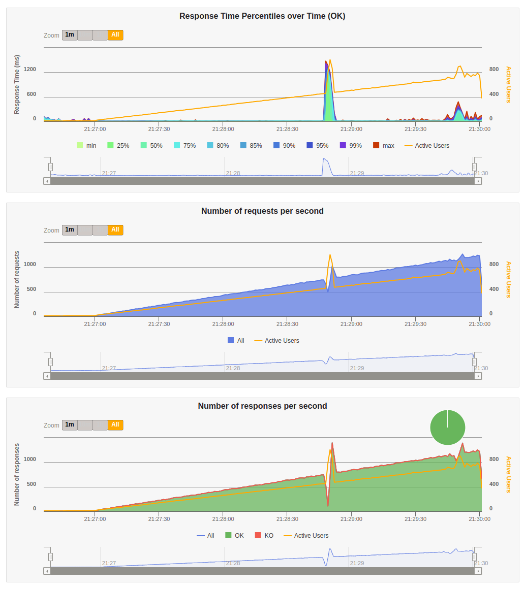
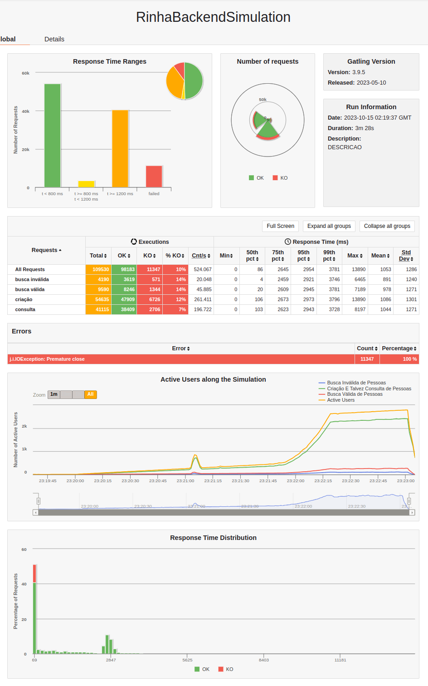
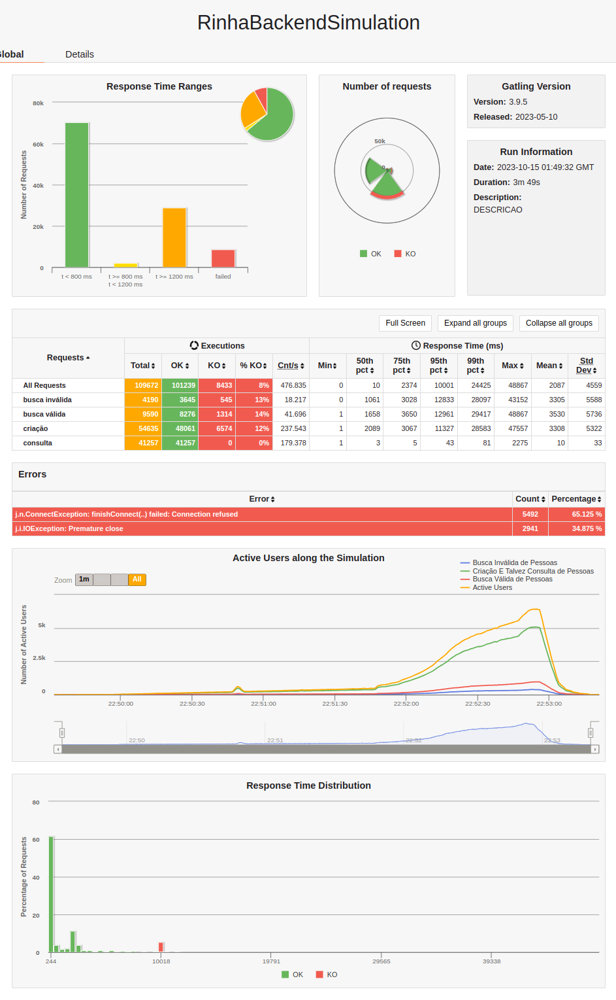

# Rinha de backend

Implementação em elixir da [rinha de backend 2023 Q3](https://github.com/zanfranceschi/rinha-de-backend-2023-q3).

Comecei a trabalhar no projeto depois de sairem todos os resultados e os vídeos do Akita e MrPowerGamerBR, então a maioria dos "truques" já eram amplamente conhecidos. O que fiz foi tentar explorar novos "truques" além dos que eram conhecidos, além de usar esse projeto como um tempo de estudos e exploração de novas tecnológias.

## Outras implementações

- [Elixir](https://github.com/ogabriel/rinha-de-backend-elixir)
- [Golang](https://github.com/ogabriel/rinha-de-backend-golang)
- [PHP](https://github.com/ogabriel/rinha-de-backend-php)

## Objetivo

Implementar a rinha em ruby on rails, e sem fazer nenuma adição de cache e batch insert.

Utilizando os aprendizados anteriores com a [implementação em elixir](https://github.com/ogabriel/rinha-backend-elixir)

## Testes

1. ativar YJIT
    - permite sair de 18-20K para 25K-29K
2. ajustar puma
    - ajustar a quantidade de workers
    - diferença grande, saiu dos 20K-29K para 30K-40K
3. `worker_connections` do nginx
    - qualquer coisa acima de 512 os resultados pioram de 40K para 35-38K

## Conclusão

Mesmo com os aprendizados anteriores da implementação em elixir, ruby on rails simplesmente não é capaz de entregar o mesmo nível de performance e conseguir os 46K e zero KOs nos limites da rinha.

Muito disso pois os requisitos de CPU são muito mais altos, na implementação em elixir, uma instância conseguia cuidar de todas as requisições tranquilamente com 0.5 CPU e 30 conexões com o banco, mas em ruby é necessário cerca de 2 CPU (e 2 worker no puma) e 60 conexões (connection_pool não parece ser tão eficiente) para atingir um resultado parecido e mesmo assim, a latência vai estar lá em cima.

Obviamente existem formas de "bular" isso, com batch insert, mas fazer isso foge um pouco do meus propósitos.

## Resultados

### Desktop

|CPU|RAM|
|---|---|
|Ryzen 5900X|32GB|

#### Duas instâncias (com nginx)

##### Resultado do gatling navegador




##### Resultado do gatling console

```
Simulation RinhaBackendSimulation completed in 205 seconds
Parsing log file(s)...
Parsing log file(s) done
Generating reports...

================================================================================
---- Global Information --------------------------------------------------------
> request count                                     114991 (OK=114991 KO=0     )
> min response time                                      0 (OK=0      KO=-     )
> max response time                                    114 (OK=114    KO=-     )
> mean response time                                     1 (OK=1      KO=-     )
> std deviation                                          2 (OK=2      KO=-     )
> response time 50th percentile                          1 (OK=1      KO=-     )
> response time 75th percentile                          1 (OK=1      KO=-     )
> response time 95th percentile                          2 (OK=2      KO=-     )
> response time 99th percentile                          7 (OK=7      KO=-     )
> mean requests/sec                                558.209 (OK=558.209 KO=-     )
---- Response Time Distribution ------------------------------------------------
> t < 800 ms                                        114991 (100%)
> 800 ms <= t < 1200 ms                                  0 (  0%)
> t >= 1200 ms                                           0 (  0%)
> failed                                                 0 (  0%)
================================================================================
A contagem de pessoas é: 46576
```

#### Uma instância (sem nginx)

##### Resultado do gatling navegador




##### Resultado do gatling console

```
Simulation RinhaBackendSimulation completed in 205 seconds
Parsing log file(s)...
Parsing log file(s) done
Generating reports...

================================================================================
---- Global Information --------------------------------------------------------
> request count                                     114991 (OK=114991 KO=0     )
> min response time                                      0 (OK=0      KO=-     )
> max response time                                   1475 (OK=1475   KO=-     )
> mean response time                                    20 (OK=20     KO=-     )
> std deviation                                        108 (OK=108    KO=-     )
> response time 50th percentile                          3 (OK=3      KO=-     )
> response time 75th percentile                          5 (OK=5      KO=-     )
> response time 95th percentile                         39 (OK=39     KO=-     )
> response time 99th percentile                        534 (OK=534    KO=-     )
> mean requests/sec                                558.209 (OK=558.209 KO=-     )
---- Response Time Distribution ------------------------------------------------
> t < 800 ms                                        114110 ( 99%)
> 800 ms <= t < 1200 ms                                654 (  1%)
> t >= 1200 ms                                         227 (  0%)
> failed                                                 0 (  0%)
================================================================================
A contagem de pessoas é: 46576
```

### Laptop

|CPU|RAM|
|---|---|
|Ryzen 4750U|16GB|

#### Duas instâncias (com nginx)

##### Resultado do gatling navegador

Com o nginx bem tunado, o tempo de resposta é até melhor do que sem ele.




##### Resultado do gatling console

```
================================================================================
---- Global Information --------------------------------------------------------
> request count                                     109530 (OK=98183  KO=11347 )
> min response time                                      0 (OK=0      KO=0     )
> max response time                                  13890 (OK=13890  KO=8     )
> mean response time                                  1053 (OK=1175   KO=0     )
> std deviation                                       1286 (OK=1304   KO=0     )
> response time 50th percentile                         86 (OK=412    KO=0     )
> response time 75th percentile                       2645 (OK=2693   KO=1     )
> response time 95th percentile                       2954 (OK=2988   KO=1     )
> response time 99th percentile                       3781 (OK=3793   KO=1     )
> mean requests/sec                                524.067 (OK=469.775 KO=54.292)
---- Response Time Distribution ------------------------------------------------
> t < 800 ms                                         54176 ( 49%)
> 800 ms <= t < 1200 ms                               3493 (  3%)
> t >= 1200 ms                                       40514 ( 37%)
> failed                                             11347 ( 10%)
---- Errors --------------------------------------------------------------------
> j.i.IOException: Premature close                                11347 (100.0%)
================================================================================
A contagem de pessoas é: 41115
```

##### Recusos do docker durante a parte mais pesada do teste


#### Uma instância (sem nginx)

##### Resultado do gatling navegador




##### Resultado do gatling console

```
================================================================================
---- Global Information --------------------------------------------------------
> request count                                     109672 (OK=101239 KO=8433  )
> min response time                                      0 (OK=0      KO=7135  )
> max response time                                  48867 (OK=48867  KO=43425 )
> mean response time                                  2087 (OK=1154   KO=13288 )
> std deviation                                       4559 (OK=2775   KO=6475  )
> response time 50th percentile                         10 (OK=7      KO=10001 )
> response time 75th percentile                       2374 (OK=2098   KO=12964 )
> response time 95th percentile                      10001 (OK=5420   KO=29727 )
> response time 99th percentile                      24425 (OK=11839  KO=34688 )
> mean requests/sec                                476.835 (OK=440.17 KO=36.665)
---- Response Time Distribution ------------------------------------------------
> t < 800 ms                                         70410 ( 64%)
> 800 ms <= t < 1200 ms                               1897 (  2%)
> t >= 1200 ms                                       28932 ( 26%)
> failed                                              8433 (  8%)
---- Errors --------------------------------------------------------------------
> j.n.ConnectException: finishConnect(..) failed: Connection ref   5492 (65.13%)
used
> j.i.IOException: Premature close                                 2941 (34.87%)
================================================================================
A contagem de pessoas é: 41257
```

##### Recusos do docker durante a parte mais pesada do teste


