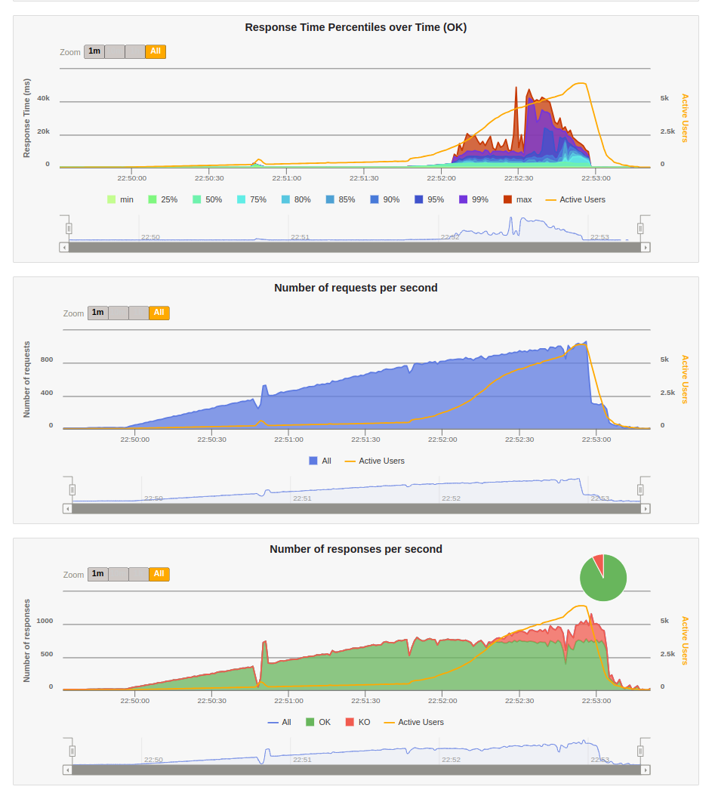
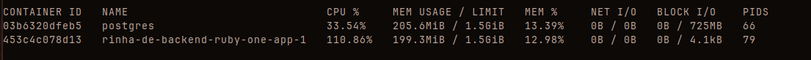
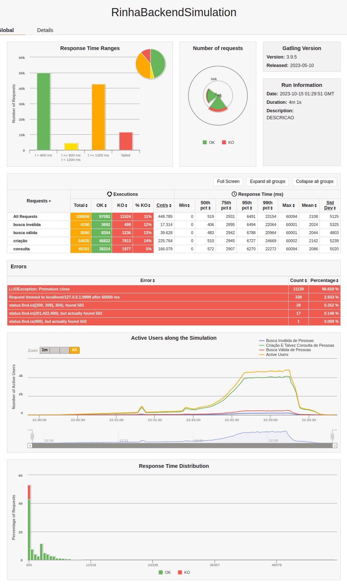
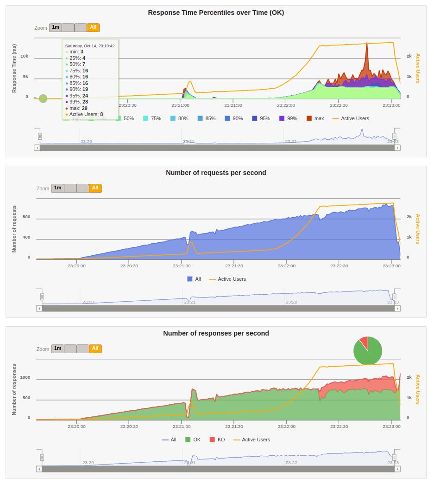

# Rinha de backend

Implementação em elixir da [rinha de backend 2023 Q3](https://github.com/zanfranceschi/rinha-de-backend-2023-q3)

## Objetivo

Implementar a rinha em ruby on rails, e sem fazer nenuma adição de cache e batch insert.

Utilizando os aprendizados anteriores com a [implementação em elixir](https://github.com/ogabriel/rinha-backend-elixir)

## Testes

1. ativar YJIT
    - permite sair de 18-20K para 25K-29K
2. ajustar puma
    - ajustar a quantidade de workers
    - diferença grande, saiu dos 20K-29K para 30K-40K
3. `worker_connections` do nginx
    - qualquer coisa acima de 512 os resultados pioram de 40K para 35-38K

## Conclusão

Mesmo com os aprendizados anteriores da implementação em elixir, ruby on rails simplesmente não é capaz de entregar o mesmo nível de performance e conseguir os 46K e zero KOs nos limites da rinha.

Muito disso pois os requisitos de CPU são muito mais altos, na implementação em elixir, uma instância conseguia cuidar de todas as requisições tranquilamente com 0.5 CPU e 30 conexões com o banco, mas em ruby é necessário cerca de 2 CPU (e 2 worker no puma) e 60 conexões (connection_pool não parece ser tão eficiente) para atingir um resultado parecido e mesmo assim, a latência vai estar lá em cima.

Obviamente existem formas de "bular" isso, com batch insert, mas fazer isso foge um pouco do meus propósitos.

## Resultados

### Uma instância (sem nginx)

#### Resultado do gatling navegador




#### Resultado do gatling console

```
================================================================================
---- Global Information --------------------------------------------------------
> request count                                     109672 (OK=101239 KO=8433  )
> min response time                                      0 (OK=0      KO=7135  )
> max response time                                  48867 (OK=48867  KO=43425 )
> mean response time                                  2087 (OK=1154   KO=13288 )
> std deviation                                       4559 (OK=2775   KO=6475  )
> response time 50th percentile                         10 (OK=7      KO=10001 )
> response time 75th percentile                       2374 (OK=2098   KO=12964 )
> response time 95th percentile                      10001 (OK=5420   KO=29727 )
> response time 99th percentile                      24425 (OK=11839  KO=34688 )
> mean requests/sec                                476.835 (OK=440.17 KO=36.665)
---- Response Time Distribution ------------------------------------------------
> t < 800 ms                                         70410 ( 64%)
> 800 ms <= t < 1200 ms                               1897 (  2%)
> t >= 1200 ms                                       28932 ( 26%)
> failed                                              8433 (  8%)
---- Errors --------------------------------------------------------------------
> j.n.ConnectException: finishConnect(..) failed: Connection ref   5492 (65.13%)
used
> j.i.IOException: Premature close                                 2941 (34.87%)
================================================================================
A contagem de pessoas é: 41257
```

#### Recusos do docker durante a parte mais pesada do teste



### Duas instâncias

#### Resultado do gatling navegador




#### Resultado do gatling console

```
================================================================================
---- Global Information --------------------------------------------------------
> request count                                     108606 (OK=97082  KO=11524 )
> min response time                                      0 (OK=0      KO=0     )
> max response time                                  60094 (OK=59740  KO=60094 )
> mean response time                                  2108 (OK=2135   KO=1880  )
> std deviation                                       5125 (OK=4057   KO=10433 )
> response time 50th percentile                        519 (OK=694    KO=0     )
> response time 75th percentile                       2931 (OK=2980   KO=1     )
> response time 95th percentile                       6491 (OK=6686   KO=48    )
> response time 99th percentile                      23154 (OK=18603  KO=60001 )
> mean requests/sec                                448.785 (OK=401.165 KO=47.62 )
---- Response Time Distribution ------------------------------------------------
> t < 800 ms                                         50006 ( 46%)
> 800 ms <= t < 1200 ms                               4455 (  4%)
> t >= 1200 ms                                       42621 ( 39%)
> failed                                             11524 ( 11%)
---- Errors --------------------------------------------------------------------
> j.i.IOException: Premature close                                11139 (96.66%)
> Request timeout to localhost/127.0.0.1:9999 after 60000 ms        338 ( 2.93%)
> status.find.in([200, 209], 304), found 502                         29 ( 0.25%)
> status.find.in(201,422,400), but actually found 502                17 ( 0.15%)
> status.find.is(400), but actually found 502                         1 ( 0.01%)
================================================================================
A contagem de pessoas é: 40195
```

#### Recusos do docker durante a parte mais pesada do teste


